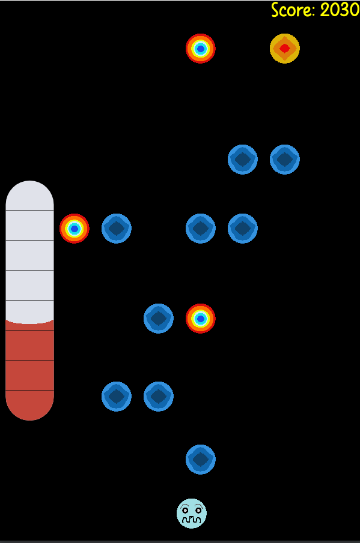

# Stay in the norms

My entry for Pygame Community Spring Jam 2024, where the theme was "Temperature".

I didn't have enough time to polish it, and I don't think you will have fun playing it, 
but still, I was really happy while developing it, so I guess it's the most important! 

## Background

You control a cell, that's quite sensitive regarding its temperature... You enjoy to be on the perfect spot, and
any too big divergence from it can be fatal.
Unfortunately, your world is quite gloomy: other cells keep rushing into you, and of course, they are not as temperate as you.
So your life can be sum up at dodging these cells, for the shake of your *temperature sanity*.

## Controls

S/F or arrows to move.
Seems easy, right?

## Troubleshooting

:warning: It's possible the bottom of your window will not be properly rendered (blank space). I have no idea why it is this way, but just moving the window
should be enough to force it to redraw entirely.

## Tools used

Of course, pygame-ce was the main library used for making this game, but I also decided to use my own UI manager to design the menu interfaces: [pygame-popup](https://pygame-popup-manager.readthedocs.io/en/latest/usage.html).
For all the sprites, I used [Piskel](https://www.piskelapp.com/)... I know, it looks like I asked my 5-years-old brother to do them but that's just how far I am in pixel art.

## Plan for improvement

I was thinking about adding way more cell variety.
Like faster cells (could be easier or more complicate to dodge, needs to be experimented), bigger cells that will impact
temperature shift more heavily or bonus cells, that would just increase the score (without any bad side effect).

I was also considering replacing controls from keys input to mouse movement, I think then it would be easier to quickly move from
one edge of the level to another one... Would be useful to survive at higher difficulty levels.

